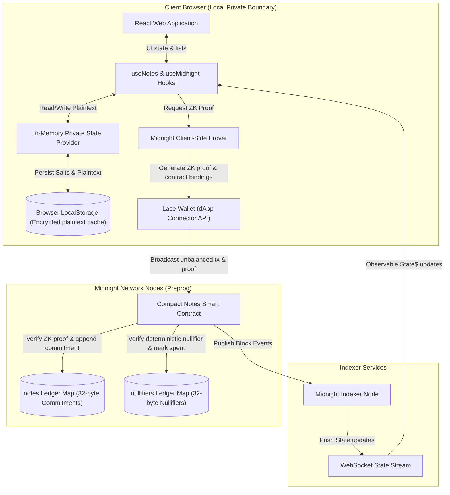
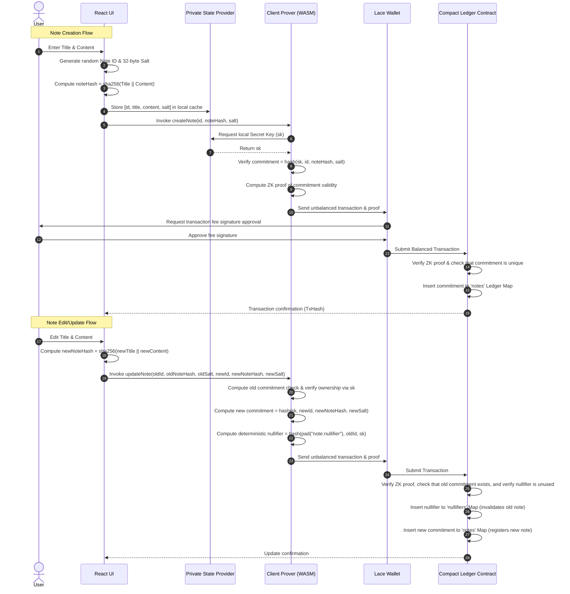
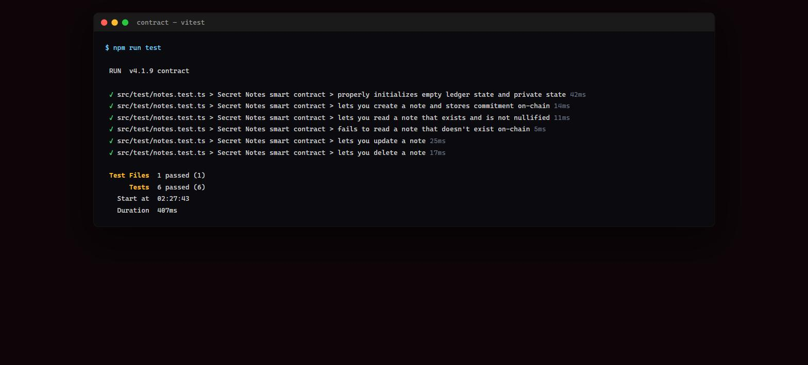
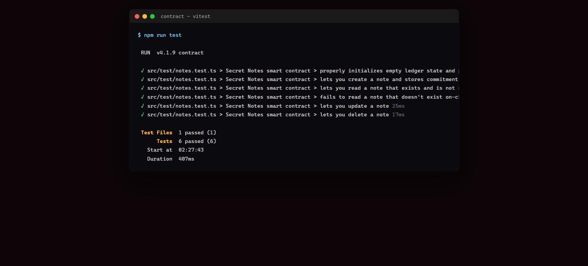
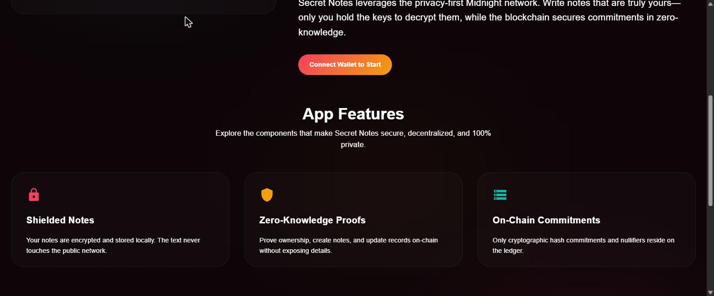
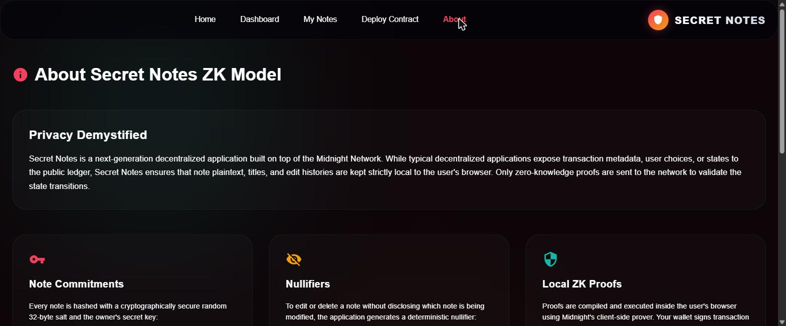
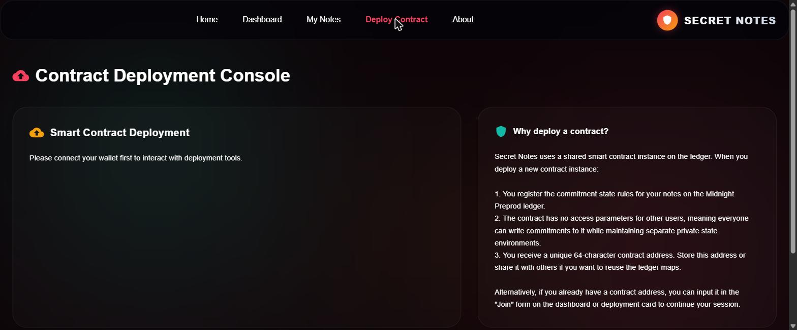
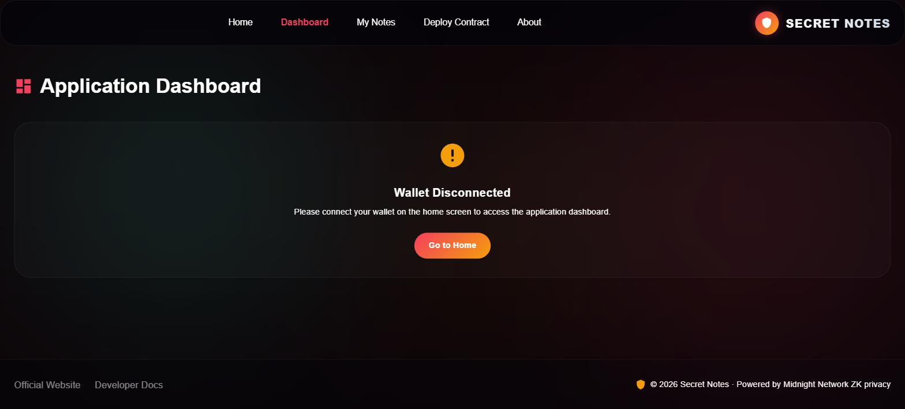

# Secret Notes DApp on Midnight Network

[](https://github.com/debojyoti10CC/midlevel2/actions/workflows/ci.yaml)
[](https://nodejs.org/)
[](https://www.typescriptlang.org/)
[](https://react.dev/)
[](https://vite.dev/)
[](https://midnight.network/)
[](https://midnight.network/)

Welcome to **Secret Notes**, a premium, production-grade, privacy-preserving private notes application built on the **Midnight Network** utilizing zero-knowledge (ZK) proofs. Secret Notes allows users to perform full CRUD operations (Create, Read, Update, Delete) on private notes. Note plaintexts, titles, and secret keys never leave the user's browser, while the blockchain secures cryptographic commitments to verify state transitions.

**Live Demo**: [https://midlevel2-fp11.vercel.app/#/](https://midlevel2-fp11.vercel.app/#/)

---

## 1. System Architecture

The Secret Notes DApp splits operations between **local client-side execution** (private state, proving) and **on-chain consensus verification** (public ledger state).

### Architecture Flowchart



---

## 2. Architecture Details

The following table breaks down each component, its execution context, security boundary, and role:

| Component | Execution Context | Privacy Level | Data Handled | Function / Role |
| :--- | :--- | :--- | :--- | :--- |
| **React UI** | Browser (Client) | Private / Local | Note Plaintext, Titles, Salts, UI states | Interactive user panel for writing, editing, and viewing private notes. |
| **Private State Provider** | Browser (Memory) | Private / Local | Note Plaintext, Salts, Wallet Secret Keys (`sk`) | Orchestrates client-side encryption caches and handles localStorage synchronization. |
| **Midnight Prover** | Browser (Local WebAssembly) | Private / Local | Circuit private inputs, salts, keys | Computes local ZK proofs verifying that state transitions (e.g. note edits) follow the smart contract rules. |
| **Lace Wallet** | Extension (Sandbox) | Private / Secure Extension | UTXO balances, fees, transaction signatures | Prompts user signature popups, executes coin-balancing, and broadcasts the finalized ZK transaction. |
| **Compact Smart Contract** | Midnight Ledger | Public / On-Chain | ZK proofs, commitments, nullifiers | Enforces note ownership constraints, double-spending validation, and stores cryptographically hidden state logs. |
| **Midnight Indexer** | Public Service | Public Node | Transaction indices, block headers, state events | Scans blocks, parses public commitments and nullifiers, and pushes updates via WebSockets back to the UI. |

---

## 3. Privacy Model — What an Observer Can and Cannot Learn

An "observer" here means anyone with read access to the public Midnight ledger and indexer: block explorers, other network participants, or the indexer operator itself. They see every transaction Secret Notes submits, but nothing more than what's listed below.

### What an observer CAN learn

| Observable | Why it's visible |
| :--- | :--- |
| **That some wallet interacted with the Secret Notes contract** | The contract address and transaction sender are public, like any on-chain transaction. |
| **The number of notes ever created (ledger map size)** | `notes` and `nullifiers` are public ledger maps; their sizes (`.size()`) are readable by anyone querying contract state. |
| **A note's 32-byte commitment hash** | `commitment = persistentHash([sk, id, noteHash, salt])` is stored on-chain verbatim so the ledger can check uniqueness. |
| **A note's 32-byte nullifier hash, once it's edited or deleted** | `nullifier = persistentHash([pad("note:nullifier"), id, sk])` is posted on-chain to prevent replay/double-spend of that note's identity. |
| **Approximate timing of note activity** | Block timestamps reveal *when* a create/update/delete transaction landed, even though the content is opaque. |
| **Transaction fee and gas metadata** | Standard for any Midnight/Cardano-style transaction; unrelated to note content. |

### What an observer CANNOT learn

| Hidden data | Why it stays hidden |
| :--- | :--- |
| **Note title or content** | Never transmitted or stored on-chain in any form — plaintext lives only in the browser's local cache. Only `sha256(title \|\| content)` folded into the commitment ever reaches the network, and SHA-256 is one-way: the hash cannot be inverted to recover the text. |
| **Which specific note a transaction refers to** | Commitments and nullifiers are indistinguishable 32-byte hashes; without the private salt and secret key used to derive them, an observer cannot map a hash back to "note #3 titled X." |
| **Whether two notes belong to the same owner** | Commitments are salted with a fresh random 32 bytes per note and mixed with the wallet's secret key, so two notes from the same wallet produce unrelated-looking commitments — there's no on-chain link between them. |
| **The wallet's secret key (`sk`)** | Never leaves the browser; it is used only as a private witness inside the local ZK proof, never serialized into a transaction. |
| **That an update/delete is linked to its original create** | The ZK proof demonstrates knowledge of the matching `sk`, `id`, `noteHash`, and `salt` for the old commitment *without revealing them* — the on-chain footprint is just "some valid nullifier appeared," not "note X was changed to Y." |
| **Note count per individual wallet** | The public ledger only exposes the *global* size of the `notes`/`nullifiers` maps, not a per-address breakdown — there's no on-chain field that groups commitments by owner. |

In short: the chain is a append-only list of opaque commitments and nullifiers proven valid by zero-knowledge circuits. Everything a human would consider "the note" — its title, its content, and who specifically owns which entry — stays entirely client-side.

---

## 4. Data Schemas & ZK Equations

To enforce security without exposing note titles or text, the DApp maps private plaintexts to public ledger states using cryptographic hashing.

| State Name | Type | Location | Cryptographic Equation | Privacy Guarantee |
| :--- | :--- | :--- | :--- | :--- |
| **Note Hash** | `Bytes[32]` | Local Cache / Private Input | `noteHash = sha256(title || content)` | Observers cannot learn note titles or content due to one-way hash property. |
| **Note Salt** | `Bytes[32]` | Private State / Local Storage | `salt = random32Bytes()` | Prevents rainbow-table brute-forcing of short or predictable note content. |
| **Note Commitment** | `Bytes[32]` | On-Chain Ledger Map (`notes`) | `commitment = persistentHash([sk, id, noteHash, salt])` | Hides the note's identity and data, binding it to the owner's secret key (`sk`). |
| **Note Nullifier** | `Bytes[32]` | On-Chain Ledger Map (`nullifiers`) | `nullifier = persistentHash([pad("note:nullifier"), id, sk])` | Proves double-spending/edit authorization without linking back to the original commitment. |

---

## 5. State Transition Workflow

The sequence diagram below displays the operation flow when a user creates, edits, or deletes a private note:



---

## 6. ZK Smart Contract Constraints

The [notes.compact](file:///Ubuntu-22.04/home/sylvia/level2/contract/src/notes.compact) smart contract enforces the following zero-knowledge assertions during state execution:

1. **Ownership Constraint**: In `updateNote` and `deleteNote` circuits, the client must prove knowledge of the wallet secret key `sk` that matches the salt and hash of the original commitment.
2. **Double-Spend Prevention**: The contract checks the deterministic `nullifiers` ledger map. If the nullifier already exists, the transaction fails immediately.
3. **Commitment Integrity**: When creating or updating a note, the commitment must not exist on-chain beforehand. This prevents replays and overwrites.

---

## 7. Folder Structure

```text
├── contract/            # Compact smart contract circuits & unit tests
│   ├── src/
│   │   ├── notes.compact  # ZK circuits (create, read, update, delete)
│   │   ├── witnesses.ts   # Private state witnesses mapping
│   │   ├── index.ts       # Compiled contract exporter
│   │   └── test/          # Vitest suite using contract simulator
├── api/                 # TypeScript client API layer
│   ├── src/
│   │   ├── index.ts       # NotesAPI class (deploy, join, CRUD calls)
│   │   └── common-types.ts# Types mapping derived state
└── bboard-ui/           # React/Vite/MUI glassmorphism frontend application
    ├── src/
    │   ├── services/      # Wallet, Contract, Notes, Network services
    │   ├── hooks/         # useWallet, useNotes, useNetwork, useMidnight
    │   ├── components/    # Navbar, Footer, NoteCard, WalletCard, LoadingSpinner
    │   └── pages/         # Home, Dashboard, MyNotes, Deploy, About
```

---

## 8. Installation & Running

### Prerequisites

* Node.js `>= 24.11.1` (or managed via NVM)
* Midnight Compact Compiler (installed globally under WSL)

### Instructions

1. Clone the repository and install root dependencies:
   ```bash
   npm install
   ```

2. Build all workspaces (contract compiling, API types compilation, Vite UI bundling):
   ```bash
   npm run build
   ```

3. Launch the development server locally:
   ```bash
   npm run dev --workspace=@midnight-ntwrk/bboard-ui
   ```

---

## 9. Smart Contract Compilation

To compile `notes.compact` into TypeScript interfaces and generate ZKIR keys, execute inside the `contract` folder:
```bash
npm run compact
```

To run the ZK contract simulator unit tests:
```bash
npm run test
```

### Test Output

The contract's Vitest suite exercises the full circuit lifecycle against the compiled ZK simulator — initial state, `createNote`, `readMyNotes` (both the happy path and the not-found case), `updateNote`, and `deleteNote`:



This same suite runs on every push and pull request via the [CI workflow](.github/workflows/ci.yaml) — see the CI badge at the top of this README for the latest run.

---

## 10. Deployment Guide

To deploy the smart contract to Midnight Preprod:
1. Ensure your browser is running the Lace Wallet extension set to Preprod network.
2. Navigate to the **Deploy Contract** tab in the UI.
3. Click **Deploy Compact Notes Contract**.
4. Approve the gas fee balancing request in the Lace Wallet pop-up.
5. The deployed contract address will be displayed and automatically saved to your browser session.

---

## 11. Wallet Setup

1. Install the official **Midnight Lace Wallet** or **1AM Wallet** extension in your browser.
2. Select the **Midnight Preprod** network configuration.
3. Fund your wallet address with Preprod tADA/tDUSK test tokens from the official faucet.
4. Click **Connect Wallet** in the application navbar or home screen.

---

## 12. Preprod Environment

To check transaction confirmation statuses or view block operations, use the Midnight Preprod Network Indexer:
* **Preprod Indexer**: `https://indexer.preprod.midnight.network`
* **Proof Prover Service**: `http://localhost:6300` (or the RPC prover configured in your Lace wallet)

---

## 13. Screenshots & Demo Video

### Application Screenshots

**Home Screen** — hero, wallet connect card, and network-mismatch handling:


**App Features** section on the home page:


**About / Privacy Model** page — the on-chain ZK principles explained in-app:


**Contract Deployment Console**:


**Dashboard** — gated behind wallet connection:


### Project Demo Video

* **Video Walkthrough**: [Watch on YouTube](https://youtu.be/WwQ3Vfvapk4) — wallet connect and a full circuit call walkthrough on the live deployment.

---

## 14. Deployed Preprod Contract

* **Network**: Midnight Preprod
* **Contract Transaction Hash**: `fc5c0bb9b553f90e7efe9415d63e2681d54bfc24bf98928eea08bda41c34120a`
* **Block**: #2,248,414
* **Status**: Success (deployment fee: 1 speck)
* **Verify on-chain**: [View on 1AM Explorer](https://explorer.1am.xyz/tx/fc5c0bb9b553f90e7efe9415d63e2681d54bfc24bf98928eea08bda41c34120a?network=preprod)
